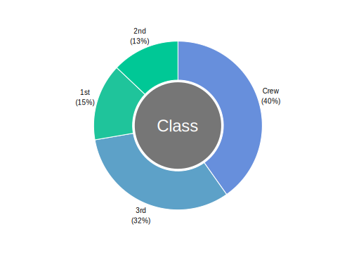
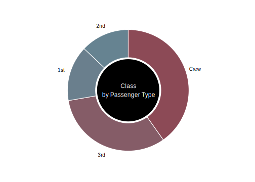

# donutchart
Donut chart for R.

A donut chart is similar to a pie chart, but uses the center (i.e., the donut whole) as a label display.

The following are easily customizable:

- The center label
- The center label's font size
- The center's color
- The color spectrum to use for the outer slices
- Whether percentages should be included on the outer labels

Usage
--------

```r
library(tidyverse)
library(donutchart)

as_tibble(Titanic) %>% count(Class, wt=n) %>% rename(PassengersCount=nn) %>%
  donut_chart(Class, PassengersCount, "Class")
```



```r
library(tidyverse)
library(donutchart)

as_tibble(Titanic) %>% count(Class, wt=n) %>% rename(PassengersCount=nn) %>%
  donut_chart(Class, PassengersCount, includePercentage=F,
              "Class\nby Passenger Type", centerLabelSize=12, centerColor="black",
              startColor="#668391", endColor="#8C4A56")
```


